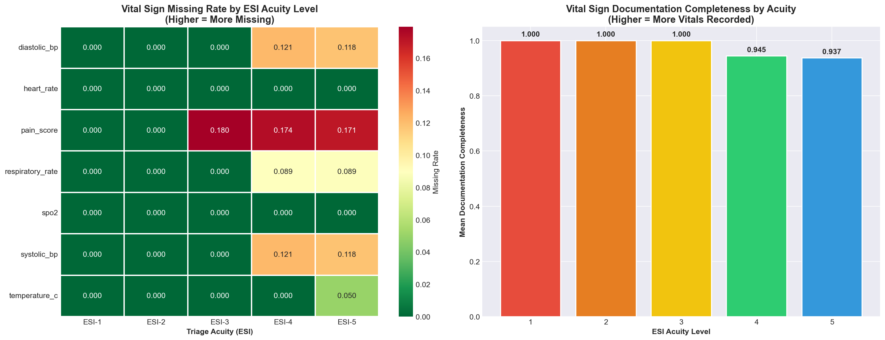
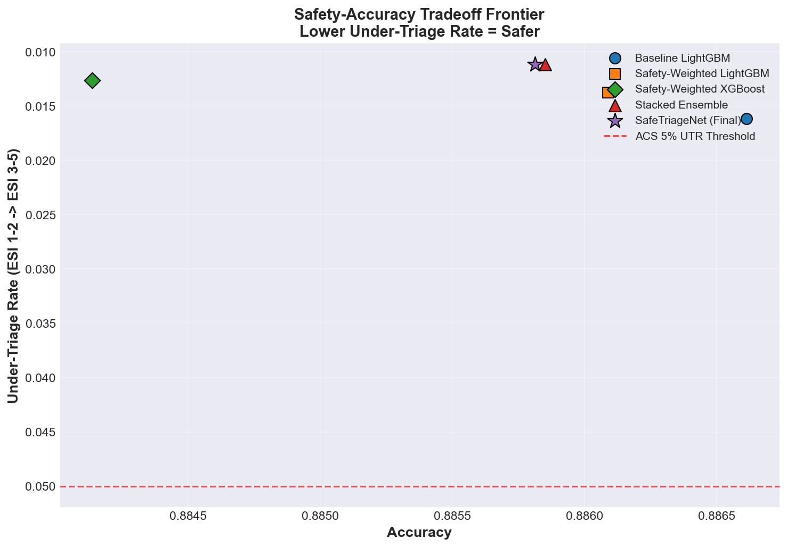
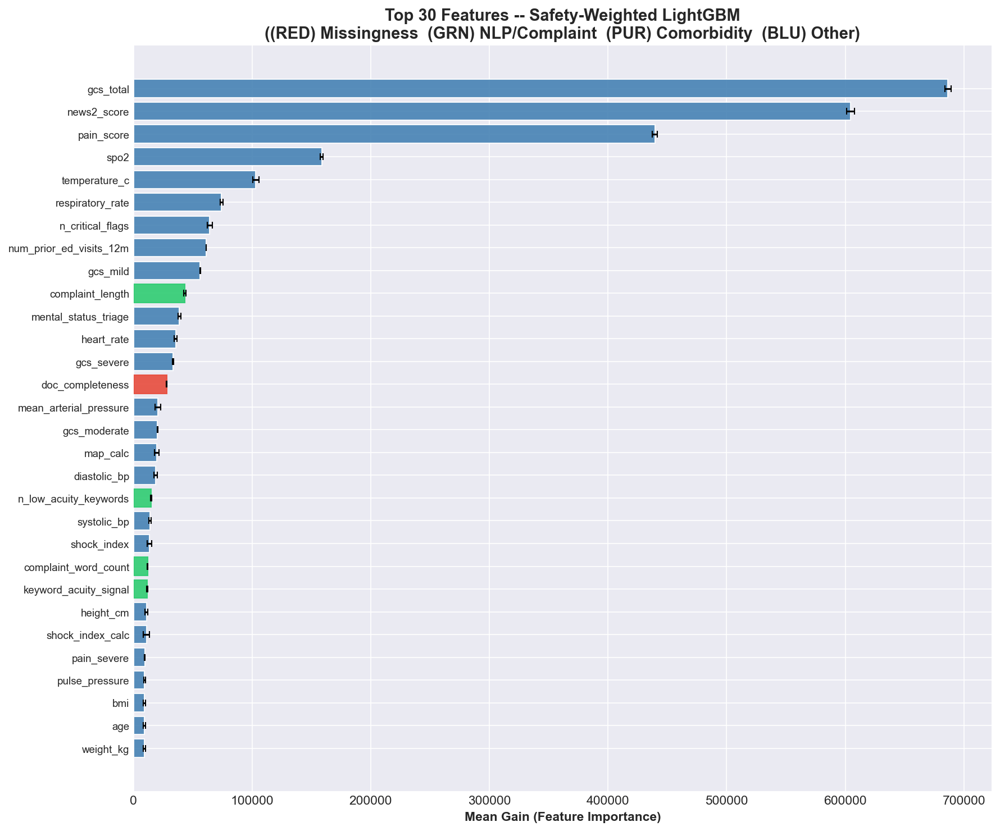

# SafeTriageNet: When Safer Failure Matters More Than Higher Accuracy

*A safety-aware triage decision-support prototype with informative missingness, multimodal intake features, and asymmetric clinical evaluation.*

---

## 1. Clinical Problem Statement

Emergency triage is a ranking decision disguised as a classification task. The triage nurse is deciding, under time pressure and with partial information, who can safely wait and who cannot. In that setting, all errors are not equal: **over-triaging** a stable patient consumes resources and slows the department, but **under-triaging** a critically ill patient delays life-saving care and can be fatal. The American College of Surgeons' Committee on Trauma treats this asymmetry as a patient-safety standard and recommends an under-triage rate below 5% for trauma systems. Emergency Severity Index (ESI) literature (Mistry 2018; Hinson 2019) also documents substantial inter-rater variability and systematic under-triage of older, non-English-speaking, and minority patients.

An AI triage tool that only maximizes top-1 accuracy inherits none of this structure — it treats a dangerous miss and a harmless over-call as equivalent errors. **SafeTriageNet** is built around the opposite principle: at comparable overall accuracy, the model that fails in a safer direction is the better clinical tool. It predicts ESI acuity (1 = Resuscitation, 5 = Non-urgent) from **intake-time information only** — variables like final disposition and ED length of stay are deliberately excluded so the model stays aligned with the moment the decision actually happens.

## 2. Data

The project uses the synthetic Triagegeist dataset published by the Laitinen-Fredriksson Foundation: 80,000 train and 20,000 test visits, plus a free-text chief-complaint table and a structured comorbidity history. The target `triage_acuity` is imbalanced — ESI-3 and ESI-4 dominate, while ESI-1 is the rarest and most consequential class. One property of the data shaped the approach from the start: missing vitals are not uniformly random, and the pattern of what gets recorded appears to carry clinical signal — a hypothesis tested directly rather than assumed.

## 3. Methodology

SafeTriageNet rests on three design decisions.

### 3.1 Informative-missingness features

Most baselines impute missing vitals and move on. I instead create explicit features from the pattern of missingness itself: per-vital missing-indicator flags, a `doc_completeness` score (fraction of core vitals recorded), and a total missing-vital count. A chi-square test against acuity confirms the signal is real but not universal: **four of six core vitals (systolic BP, diastolic BP, respiratory rate, temperature) show highly significant (p < 0.001) missingness–acuity associations**; heart rate and SpO₂ do not. Informative missingness is therefore an important but **non-universal** signal — a nuance worth preserving rather than smoothing over.

*Figure 1 — Vital-sign missingness by ESI level. Some vitals (BP, respiratory rate, NEWS2 inputs, pain) are systematically less likely to be recorded in lower-acuity visits; heart rate and SpO₂ are recorded nearly universally. Documentation completeness (right panel) rises monotonically with acuity, and ends up as a top-ranked predictor in the final model.*

### 3.2 Multimodal intake feature set

The pipeline builds a single 146-feature modeling table combining raw physiology and demographics (BP, HR, RR, temperature, SpO₂, GCS, pain, age, arrival mode, prior utilization); derived clinical features clinicians would recognize (Shock Index, MAP, Pulse Pressure, abnormality flags, and a count of concurrent critical-physiology findings); lightweight complaint NLP (length, keyword counts, and targeted flags for chest pain, dyspnea, altered mental status, trauma, neurologic symptoms, GI bleed, mental-health crisis); comorbidity burden composites from the patient history table; and temporal context (cyclical hour/day/month encodings plus night/weekend flags).

The complaint NLP is deliberately keyword-based rather than transformer-based — that keeps the notebook reproducible, fast on CPU, and, for a clinical audience, **transparent**: the keyword list is readable, so a nurse educator can verify the system is not silently relying on spurious text artifacts. Known leakage columns (`disposition`, `ed_los_hours`, `site_id`, `triage_nurse_id`) are explicitly excluded; they are post-triage or non-clinical identifiers and have no place in an intake-time model.

### 3.3 Safety-aware modeling and asymmetric evaluation

**Base models.** Three base learners trained with 5-fold stratified cross-validation: a baseline LightGBM (standard cross-entropy, no safety weighting), a safety-weighted LightGBM (per-sample weights up-weighting ESI-1 and ESI-2 so the gradient "cares" more about rare high-acuity cases), and a safety-weighted XGBoost (same weighting on a different tree implementation for ensemble diversity).

**Stacking with honest evaluation.** Out-of-fold base probabilities are stacked with a multinomial logistic meta-learner. Critically, the meta-learner itself produces its own 5-fold out-of-fold predictions, so the reported stacked metrics are not inflated by in-sample meta-training scores. A final meta-model is fit on the full data for test inference.

**Asymmetric cost matrix.** Evaluation is governed by a 5×5 clinical cost matrix in which under-triaging ESI-1 as ESI-5 carries a cost of 20.0 while over-triaging ESI-5 as ESI-1 costs 0.1 — a 200× asymmetry. This matrix drives every downstream model-selection decision.

**Conservative-shift post-processing.** When the stacked model is uncertain (high predictive entropy), a one-level shift toward higher acuity is applied. The intent is not to force every ambiguous patient into a critical alert — it is to make the uncertain cases fail in the safer direction. The entropy threshold is selected by sweeping a small grid on out-of-fold meta probabilities.

## 4. Results

Out-of-fold comparison across all models:

| Model | Accuracy | Macro-F1 | Under-Triage | Cost-Weighted Error |
|---|---:|---:|---:|---:|
| Baseline LightGBM | 0.8866 | 0.8964 | 0.0161 | 0.2047 |
| Safety-Weighted LightGBM | 0.8861 | 0.8974 | 0.0137 | 0.2312 |
| Safety-Weighted XGBoost | 0.8841 | 0.8956 | 0.0127 | 0.2349 |
| Stacked Ensemble | 0.8859 | 0.8966 | 0.0112 | 0.2256 |
| **SafeTriageNet (Final)** | **0.8858** | **0.8965** | **0.0112** | **0.2229** |

**Headline finding.** SafeTriageNet reduces the under-triage rate from **1.61% to 1.12% — a 30% relative reduction** — while holding overall accuracy essentially flat (−0.008 absolute). **Severe under-triage (errors of ≥2 acuity levels) is 0.0% across every model.** Both the baseline and the final model clear the ACS Committee on Trauma <5% threshold, but SafeTriageNet clears it with meaningfully more margin.

*Figure 2 — Safety / accuracy tradeoff frontier. Each point is a model's out-of-fold (accuracy, under-triage rate) operating point. SafeTriageNet (star) sits at roughly the same accuracy as the baseline LightGBM (blue circle) but with a materially lower under-triage rate. The dashed red line marks the ACS Committee on Trauma 5% under-triage threshold.*

**An honest caveat.** The baseline LightGBM retains the lowest raw cost-weighted error (0.2047) because its advantage on that single number comes from a lower over-triage load, not a lower under-triage load. For safety-aware triage, under-triage is the failure mode that matters, so SafeTriageNet trades a small CWE penalty for a materially better under-triage profile. That is the right clinical tradeoff, stated explicitly rather than hidden behind a headline number.

**Feature importance.** The top-ranked features from the safety-weighted LightGBM align with how ESI is actually taught and practiced: GCS total, NEWS2, pain, SpO₂, temperature, respiratory rate, and the engineered critical-flags count. That alignment is the point — the model is learning from the same physiologic signals an EM nurse would prioritize, not from spurious artifacts. Documentation completeness appears in the top 15, confirming the informative-missingness finding.

*Figure 3 — Top-30 features by mean gain. Red bars mark informative-missingness features (note `doc_completeness`), green bars mark complaint-NLP features. The list is dominated by vitals and physiologic derivatives that match the ESI algorithm itself — a signal that the model is leaning on clinically defensible features rather than shortcuts.*

**Fairness.** Stratifying performance by sex and age group shows no large disparities: accuracy varies by roughly 1 percentage point across groups and under-triage rate stays in a narrow 1.0–1.4% band. Pediatric cases show marginally higher UTR (1.44%) — a known difficulty in ESI practice and a direction for future work.

## 5. Insight and Interpretation

**Safety-aware design changes what "better" means.** On pure accuracy the baseline LightGBM would win. Under an asymmetric clinical cost, the final system is preferable because its errors concentrate in the less dangerous direction. That tradeoff is only acceptable if triage is viewed as a patient-safety problem rather than a classification contest — I argue explicitly for the former.

**Missingness is signal, but not universally.** Four vitals out of six carried significant acuity-linked missingness; two did not. The value of the feature engineering is that it lets the data decide for each vital, rather than imposing a sweeping "missingness = signal" rule that would overstate the result.

**Breadth beats depth.** A broad multimodal intake view plus a modest modeling stack outperformed heavier alternatives. Transparent keyword features captured enough complaint-text signal to be competitive — no large language model required. For a clinical audience, that transparency is a feature, not a limitation.

## 6. Limitations

1. **Synthetic data.** All analysis is on simulated records. External validation on MIMIC-IV-ED, NHAMCS, or institutional data is a prerequisite for any clinical claim.
2. **Lightweight NLP.** Keyword features miss abbreviations, misspellings, and institution-specific shorthand. Real deployment would need domain-adapted embeddings and qualitative validation on nurse-written triage notes.
3. **Conservative-shift threshold is mildly optimistic.** The entropy cutoff is selected on out-of-fold meta probabilities and evaluated on the same folds. A fully nested held-out design would give a stricter estimate.
4. **No prospective validation.** This is a research prototype, not a deployable tool. Any real clinical use would require IRB review, integration testing, drift monitoring, and a monitored pilot with clinician override.

## 7. Reproducibility

The public Kaggle notebook (`notebooks/safetriagenet.ipynb`) is self-contained: it runs on Kaggle with no external `src/` dependency, reads data from `/kaggle/input/triagegeist/` with auto-discovery fallback, fixes `SEED = 42`, and writes `submission.csv` to the working directory. The linked repository also contains modular source in `src/` (`features.py`, `models.py`, `safety.py`), a script version of the full pipeline, and the figures and tables used above. End-to-end execution completes in about three minutes on CPU, and the notebook verifies the generated submission has the expected 20,000 × 2 shape and exact column names before writing it.

## 8. Impact Pathway

SafeTriageNet is a proof of concept, not a product. Its contribution is a **design principle** that transfers beyond this dataset: evaluate triage AI under an asymmetric cost structure that reflects real clinical stakes, treat missingness as potential signal, and select operating points that make uncertain predictions fail safely. These principles apply regardless of model architecture and regardless of whether the underlying data is synthetic, MIMIC-IV-ED, or an institutional EHR stream. For any downstream pilot of decision-support tools, **safer failure over marginal accuracy** is the right lens for measuring success.
